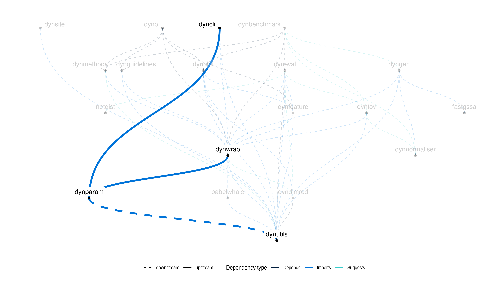

<!-- README.md is generated from README.Rmd. Please edit that file -->

# dynparam

Provides tools for describing parameters of algorithms in an abstract way. 
Description can include an id, a description, a domain (range or list of values), and a default value. 
'dynparam' can also convert parameter sets to a `ParamHelpers` format, in order to be able to use `dynparam` in conjunction with `mlrMBO`.
Check `?dynparam` for an overview of all functionality provided by dynparam.

## Examples
The main goal of `dynparam` is to be able to describe a set of parameters, 
be able to serialise the parameter sets, and also sample random settings from 
the parameter set.

```{r, message = FALSE, error = FALSE, warning = FALSE}
library(tidyverse)
library(dynparam)
set.seed(1)
```

```{r, echo=FALSE}
cat <- function(x) {
  base::cat(
    "```yaml\n",
    x, "\n", 
    "```",
    sep = ""
  )
}
```

Define a parameter set as follows:
```{r}
parameters <- parameter_set(
  integer_parameter(
    id = "num_iter",
    default = 100L,
    distribution = expuniform_distribution(lower = 1L, upper = 10000L),
    description = "Number of iterations"
  ),
  subset_parameter(
    id = "dimreds",
    default = c("pca", "mds"),
    values = c("pca", "mds", "tsne", "umap", "ica"),
    description = "Which dimensionality reduction methods to apply (can be multiple)"
  ),
  integer_range_parameter(
    id = "ks",
    default = c(3L, 15L),
    lower_distribution = uniform_distribution(1L, 5L),
    upper_distribution = uniform_distribution(10L, 20L),
    description = "The numbers of clusters to be evaluated"
  )
)
```

You can retrieve the default parameters as follows:
```{r}
get_defaults(parameters)
```

Serialise a parameter set from/to json/yaml with the `as.list()` and `as_parameter_set()` functions.
```{r}
li <- as.list(parameters)
pa <- as_parameter_set(li)
```

Sample a parameter set using with `sip()`:
```{r}
sip(pa, n = 3)
```

### Large parameter set
```{r}
parameters <- parameter_set(
  integer_parameter(
    id = "num_iter", 
    default = 100L,
    distribution = expuniform_distribution(lower = 1L, upper = 10000L),
    description = "Number of iterations"
  ),
  numeric_parameter(
  id = "delta", 
  default = c(4.5, 2.4, 1.9), 
  distribution = normal_distribution(mean = 5, sd = 1),
  description = "Multiplying factors"
),
  character_parameter(
  id = "method", 
  default = "kendall",
  values = c("kendall", "spearman", "pearson"), 
  description = "Correlation method"
),
  logical_parameter(
  id = "inverse",
  default = TRUE, 
  description = "Inversion parameter"
),
  subset_parameter(
 id = "dimreds",
 default = c("pca", "mds"),
 values = c("pca", "mds", "tsne", "umap", "ica"),
 description = "Which dimensionality reduction methods to apply (can be multiple)"
),
  integer_range_parameter(
  id = "ks",
  default = c(3L, 15L),
  lower_distribution = uniform_distribution(1L, 5L),
  upper_distribution = uniform_distribution(10L, 20L),
  description = "The numbers of clusters to be evaluated."
),
  numeric_range_parameter(
  id = "quantiles",
  default = c(0.15, 0.90),
  lower_distribution = uniform_distribution(0, .4),
  upper_distribution = uniform_distribution(.6, 1),
  description = "Quantile cutoff range"
),
  forbidden = "inverse == (method == 'kendall')"
)
```

As yaml:
```{r comment = "", results = "asis"}
cat(yaml::as.yaml(as.list(parameters)))
```

Generate a random parameter set:
```{r}
sip(parameters, n = 2)
```

Convert paramhelper object:
```{r}
as_paramhelper(parameters)
```


## Latest changes

Check out `news(package = "dynparam")` or [NEWS.md](inst/NEWS.md) for a full list of changes.

<!-- This section gets automatically generated from inst/NEWS.md, and also generates inst/NEWS -->

```{r news, echo=FALSE, results="asis"}
dynutils::update_news()
base::cat(dynutils::recent_news())
```

## Dynverse dependencies

<!-- Generated by "update_dependency_graphs.R" in the main dynverse repo -->

