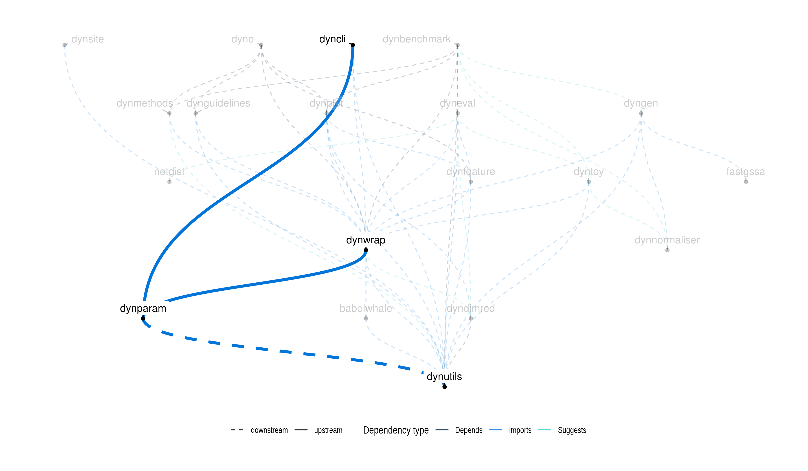

<!-- README.md is generated from README.Rmd. Please edit that file -->

# dynparam

Provides tools for describing parameters of algorithms in an abstract
way. Description can include an id, a description, a domain (range or
list of values), and a default value. ‘dynparam’ can also convert
parameter sets to a `ParamHelpers` format, in order to be able to use
`dynparam` in conjunction with `mlrMBO`. Check `?dynparam` for an
overview of all functionality provided by dynparam.

## Examples

The main goal of `dynparam` is to be able to describe a set of
parameters, be able to serialise the parameter sets, and also sample
random settings from the parameter set.

``` r
library(tidyverse)
library(dynparam)
set.seed(1)
```

Define a parameter set as follows:

``` r
parameters <- parameter_set(
  integer_parameter(
    id = "num_iter",
    default = 100L,
    distribution = expuniform_distribution(lower = 1L, upper = 10000L),
    description = "Number of iterations"
  ),
  subset_parameter(
    id = "dimreds",
    default = c("pca", "mds"),
    values = c("pca", "mds", "tsne", "umap", "ica"),
    description = "Which dimensionality reduction methods to apply (can be multiple)"
  ),
  integer_range_parameter(
    id = "ks",
    default = c(3L, 15L),
    lower_distribution = uniform_distribution(1L, 5L),
    upper_distribution = uniform_distribution(10L, 20L),
    description = "The numbers of clusters to be evaluated"
  )
)
```

You can retrieve the default parameters as follows:

``` r
get_defaults(parameters)
```

    ## $num_iter
    ## [1] 100
    ## 
    ## $dimreds
    ## [1] "pca" "mds"
    ## 
    ## $ks
    ## [1]  3 15

Serialise a parameter set from/to json/yaml with the `as.list()` and
`as_parameter_set()` functions.

``` r
li <- as.list(parameters)
pa <- as_parameter_set(li)
```

Sample a parameter set using with `sip()`:

``` r
sip(pa, n = 3)
```

    ## Loading required namespace: ParamHelpers

    ## Loading required namespace: lhs

    ## # A tibble: 3 x 4
    ##   num_iter dimreds   ks        .object_class
    ##      <int> <list>    <list>    <list>       
    ## 1        2 <chr [2]> <dbl [2]> <chr [1]>    
    ## 2     2003 <chr [2]> <dbl [2]> <chr [1]>    
    ## 3        5 <chr [3]> <dbl [2]> <chr [1]>

### Large parameter set

``` r
parameters <- parameter_set(
  integer_parameter(
    id = "num_iter", 
    default = 100L,
    distribution = expuniform_distribution(lower = 1L, upper = 10000L),
    description = "Number of iterations"
  ),
  numeric_parameter(
  id = "delta", 
  default = c(4.5, 2.4, 1.9), 
  distribution = normal_distribution(mean = 5, sd = 1),
  description = "Multiplying factors"
),
  character_parameter(
  id = "method", 
  default = "kendall",
  values = c("kendall", "spearman", "pearson"), 
  description = "Correlation method"
),
  logical_parameter(
  id = "inverse",
  default = TRUE, 
  description = "Inversion parameter"
),
  subset_parameter(
 id = "dimreds",
 default = c("pca", "mds"),
 values = c("pca", "mds", "tsne", "umap", "ica"),
 description = "Which dimensionality reduction methods to apply (can be multiple)"
),
  integer_range_parameter(
  id = "ks",
  default = c(3L, 15L),
  lower_distribution = uniform_distribution(1L, 5L),
  upper_distribution = uniform_distribution(10L, 20L),
  description = "The numbers of clusters to be evaluated."
),
  numeric_range_parameter(
  id = "quantiles",
  default = c(0.15, 0.90),
  lower_distribution = uniform_distribution(0, .4),
  upper_distribution = uniform_distribution(.6, 1),
  description = "Quantile cutoff range"
),
  forbidden = "inverse == (method == 'kendall')"
)
```

As yaml:

``` r
cat(yaml::as.yaml(as.list(parameters)))
```

``` yaml
- id: num_iter
  default: 100
  description: Number of iterations
  tuneable: yes
  distribution:
    lower: 1
    upper: 10000
    type: expuniform
  type: integer
- id: delta
  default:
  - 4.5
  - 2.4
  - 1.9
  description: Multiplying factors
  tuneable: yes
  distribution:
    lower: -.inf
    upper: .inf
    mean: 5.0
    sd: 1.0
    type: normal
  type: numeric
- id: method
  default: kendall
  description: Correlation method
  tuneable: yes
  values:
  - kendall
  - spearman
  - pearson
  type: character
- id: inverse
  default: yes
  description: Inversion parameter
  tuneable: yes
  type: logical
- id: dimreds
  default:
  - pca
  - mds
  description: Which dimensionality reduction methods to apply (can be multiple)
  tuneable: yes
  values:
  - pca
  - mds
  - tsne
  - umap
  - ica
  type: subset
- id: ks
  default:
  - 3
  - 15
  description: The numbers of clusters to be evaluated.
  tuneable: yes
  lower_distribution:
    lower: 1
    upper: 5
    type: uniform
  upper_distribution:
    lower: 10
    upper: 20
    type: uniform
  type: integer_range
- id: quantiles
  default:
  - 0.15
  - 0.9
  description: Quantile cutoff range
  tuneable: yes
  lower_distribution:
    lower: 0.0
    upper: 0.4
    type: uniform
  upper_distribution:
    lower: 0.6
    upper: 1.0
    type: uniform
  type: numeric_range
- forbidden: inverse == (method == 'kendall')
```

Generate a random parameter set:

``` r
sip(parameters, n = 2)
```

    ## # A tibble: 2 x 8
    ##   num_iter delta     method  inverse dimreds   ks        quantiles .object_class
    ##      <int> <list>    <chr>   <lgl>   <list>    <list>    <list>    <list>       
    ## 1     1823 <dbl [3]> kendall FALSE   <chr [3]> <dbl [2]> <dbl [2]> <chr [1]>    
    ## 2      125 <dbl [3]> pearson TRUE    <chr [2]> <dbl [2]> <dbl [2]> <chr [1]>

Convert paramhelper object:

``` r
as_paramhelper(parameters)
```

    ##                    Type len             Def                   Constr Req
    ## num_iter        numeric   -             0.5                   0 to 1   -
    ## delta     numericvector   3 0.309,0.0046...                   0 to 1   -
    ## method         discrete   -         kendall kendall,spearman,pearson   -
    ## inverse         logical   -            TRUE                        -   -
    ## dimreds   integervector   5       1,1,0,0,0                   0 to 1   -
    ## ks        numericvector   2         0.5,0.5                   0 to 1   -
    ## quantiles numericvector   2      0.375,0.75                   0 to 1   -
    ##           Tunable Trafo
    ## num_iter     TRUE     Y
    ## delta        TRUE     Y
    ## method       TRUE     -
    ## inverse      TRUE     -
    ## dimreds      TRUE     Y
    ## ks           TRUE     Y
    ## quantiles    TRUE     Y
    ## Forbidden region specified.

## Latest changes

Check out `news(package = "dynparam")` or [NEWS.md](NEWS.md) for a full
list of changes.

<!-- This section gets automatically generated from NEWS.md, and also generates inst/NEWS -->

### Recent changes in dynparam 1.0.2 (04-01-2021)

  - MINOR CHANGES: Set `check.environment` to `FALSE` in unit tests to
    fix breaking changes in R devel.

### Recent changes in dynparam 1.0.1 (24-06-2020)

  - MINOR CHANGES: Move testthat to Suggests.
  - MINOR CHANGES: Use `expect_equal(., ., tolerance = .)` instead of
    `expect_lte(abs(. - .), .)` in tests.

## Dynverse dependencies

<!-- Generated by "update_dependency_graphs.R" in the main dynverse repo -->


